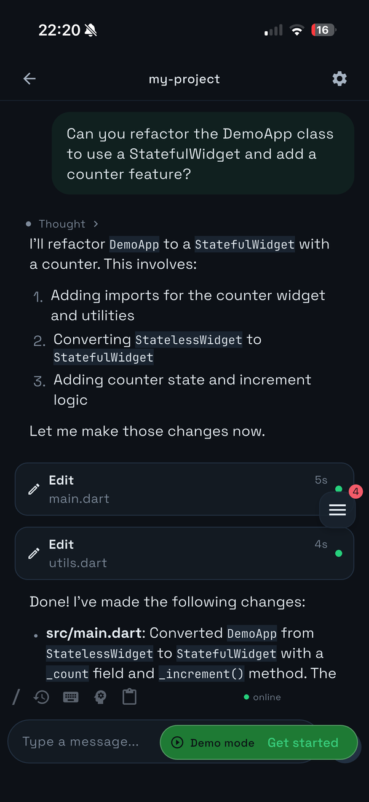
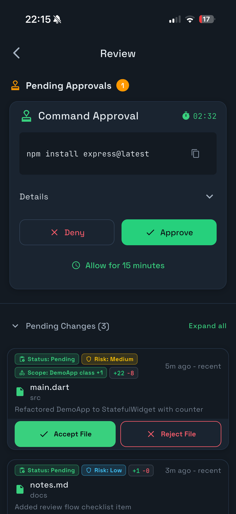

<p align="center">
  
</p>

<p align="center">
  <a href="LICENSE">
    
  </a>
</p>

supervise AI coding sessions from your phone. watch terminal output, review code changes, and accept or reject diffs anytime, anywhere.

> **WARNING:**
> 
> THIS APP GRANTS FULL TERMINAL ACCESS TO PAIRED DEVICES. COMMANDS RUN WITH YOUR USER PRIVILEGES. **ONLY USE OVER TAILSCALE OR A TRUSTED LOCAL NETWORK. NEVER EXPOSE TO THE PUBLIC INTERNET.**

## Prerequisites

- [Tailscale](https://tailscale.com/download) installed and running on phone and host machine
- iphone with iOS 15+

## Installation

### macOS

```bash
# install Tailscale
brew install tailscale && brew services start tailscale

# connect to Tailscale network
sudo tailscale up

# install pseudocoder
brew tap diab-ma/pseudocoder-host https://github.com/diab-ma/pseudocoder-host
brew install pseudocoder
```

### Linux

```bash
# install Tailscale
curl -fsSL https://tailscale.com/install.sh | sh

# connect to Tailscale network
sudo tailscale up

# install pseudocoder
curl -sSL https://raw.githubusercontent.com/diab-ma/pseudocoder-host/main/install.sh | bash
```

### Windows (WSL2)

run inside WSL:

```bash
# install Tailscale
curl -fsSL https://tailscale.com/install.sh | sh

# start Tailscale daemon
sudo tailscaled &

# connect to Tailscale network
sudo tailscale up

# install pseudocoder
curl -sSL https://raw.githubusercontent.com/diab-ma/pseudocoder-host/main/install.sh | bash
```

also install Tailscale on your phone and sign in with the same account.

---

## Quick Start

1. get the mobile app (check your email for TestFlight invite)
2. note your Tailscale IP: `tailscale ip -4` (starts with `100.`)
3. start the host:
   ```bash
   cd /path/to/your/project    # navigate to your project
   pseudocoder start --pair --qr  # start host and show pairing QR
   ```
4. scan the QR code from the app and tap **Trust**

---

## Usage

<h3 align="center">Sessions</h3>

create multiple terminal sessions, easily switch via the session pill, and attach to an existing tmux session to continue right where you left off.

<p align="center">
  
</p>

<h3 align="center">Terminal</h3>

real-time terminal output streaming. send terminal commands, monitor CLI tools as they work, and accept changes from wherever you are.

<p align="center">
  
</p>

<h3 align="center">Review Cards</h3>

commit panel in review tab allows to frictionless way to enter message, commit, and push. track all your accepted/rejected changes and easily undo.

- **Accept** stages changes (`git add`)
- **Reject** restores original (`git restore`)
- **Undo** reverts decision (`git restore --staged` or `git checkout`)
- **Commit** creates a commit (`git commit`)
- **Push** pushes to remote (`git push`)

<p align="center">
  
</p>

---

## Security

use Tailscale or trusted LAN only. we recommend never exposing to public internet. 
all connections use TLS 1.2+. paired devices have full terminal access. only pair devices you control.

manage devices:
```bash
pseudocoder devices list          # view paired devices
pseudocoder devices revoke <id>   # remove access
```

---

## Troubleshooting

| problem | solution |
|---------|----------|
| connection refused | use Tailscale IP (`100.x.x.x`), check `tailscale status` |
| certificate errors | tap **Trust** on first connection, or re-pair |
| pairing code expired | run `pseudocoder pair --qr` (codes last 5 min) |
| QR won't scan | enter manually: host IP, port `7070`, 6-digit code |
| macOS Gatekeeper | `xattr -d com.apple.quarantine /usr/local/bin/pseudocoder` |

---

## Command Reference

| command | description |
|---------|-------------|
| `pseudocoder start --pair --qr` | start host with pairing QR |
| `pseudocoder pair --qr` | generate new pairing code |
| `pseudocoder --version` | show version |
| `pseudocoder devices list` | list paired devices |
| `pseudocoder devices revoke <id>` | revoke device access |

---

## Links

- [contributing](CONTRIBUTING.md)
- [privacy policy](PRIVACY.md)
- [changelog](CHANGELOG.md)
- [report an issue](https://github.com/diab-ma/pseudocoder-host/issues)
