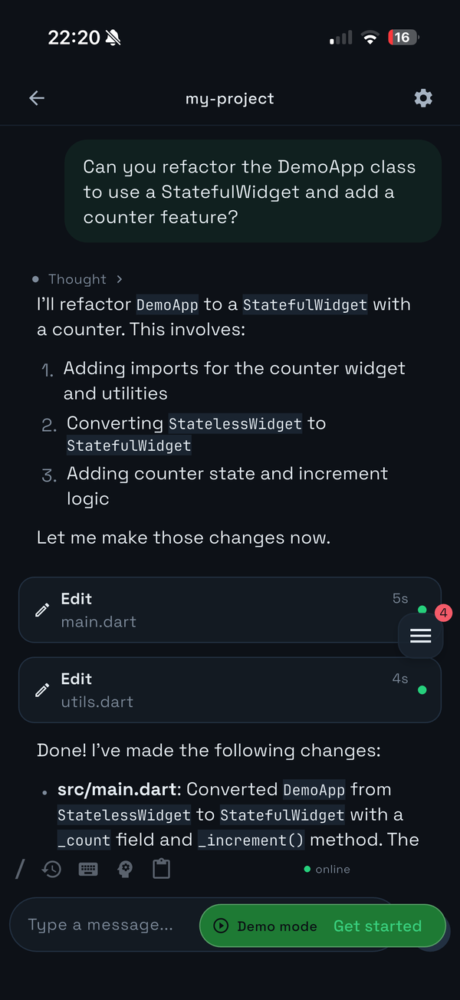
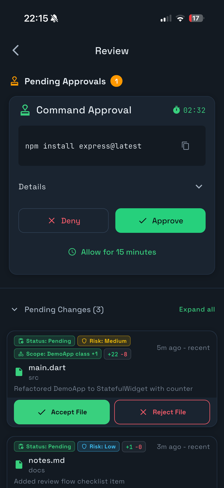

<p align="center">
  
</p>

<p align="center">
  <a href="LICENSE">
    
  </a>
  <a href="https://apps.apple.com/us/app/pseudocoder/id6757658447">
    
  </a>
  <a href="https://discord.gg/e7TaHYTxBC">
    
  </a>
</p>

run your dev workflow from your phone. chat with AI coding agents, review diffs, approve commands, manage git, edit files — no cloud, no account.

> **WARNING:** paired devices have full terminal access with your user privileges. **only use over Tailscale or a trusted local network. never expose to the public internet.**

## Install

```bash
# macOS
brew tap diab-ma/pseudocoder-host https://github.com/diab-ma/pseudocoder-host
brew install pseudocoder

# linux / WSL
curl -sSL https://raw.githubusercontent.com/diab-ma/pseudocoder-host/main/install.sh | bash
```

get the mobile app from the [App Store](https://apps.apple.com/us/app/pseudocoder/id6757658447).

## Quick Start

```bash
cd /path/to/your/project
pseudocoder start --pair --qr
```

scan the QR code from the app. that's it.

both devices need to be on the same network — [Tailscale](https://tailscale.com/download) (recommended) or local WiFi.

---

## What You Can Do

<h3 align="center">Structured Chat</h3>

chat view for AI coding agent sessions. see the agent's thinking, tool calls, and code edits in a structured timeline. approve or deny commands inline. switch to raw terminal any time.

<p align="center">
  
</p>

<h3 align="center">Diff Review</h3>

AI-generated code changes arrive as diff cards sorted by risk. accept, reject, or undo at file or chunk level.

- **Accept** stages changes (`git add`)
- **Reject** restores original (`git restore`)
- **Undo** reverses either decision

<p align="center">
  
</p>

<h3 align="center">Git</h3>

four tabs: **commit** (stage, message, push), **branch** (create, switch, delete), **PR** (list, create, checkout via `gh`), **sync** (fetch, pull, push).

<h3 align="center">File Editor</h3>

browse, read, edit, and delete files in the repo from your phone. conflict detection prevents overwrites.

<h3 align="center">Keep-Awake</h3>

prevents your mac from sleeping during active sessions. battery-aware — auto-disables below a configurable threshold.

```bash
pseudocoder keep-awake enable-remote     # allow mobile to keep host awake
pseudocoder keep-awake status            # check current state
```

---

## Security

all connections use TLS. paired devices have full terminal access — only pair devices you control.

```bash
pseudocoder devices list          # view paired devices
pseudocoder devices revoke <id>   # remove access
```

pairing codes are 6-digit, single-use, and expire after 2 minutes.

---

## Configuration

`pseudocoder start` creates `~/.pseudocoder/config.toml` with sensible defaults. key options:

| setting | default | description |
|---------|---------|-------------|
| `keep_awake_remote_enabled` | `false` | allow mobile to prevent host sleep |
| `chunk_grouping_enabled` | `true` | group related diff hunks together |
| `chunk_grouping_proximity` | `20` | max line distance for grouping |
| `history_lines` | `5000` | terminal scrollback buffer |

---

## Troubleshooting

run `pseudocoder doctor` first — it checks host health, TLS certs, and network reachability.

| problem | solution |
|---------|----------|
| can't connect | check both devices are on the same network. run `pseudocoder doctor` |
| pairing code expired | codes last 2 min. run `pseudocoder pair --qr` |
| QR won't scan | enter manually: host IP, port `7070`, 6-digit code |
| certificate errors | re-pair, or tap **Trust** on first connection |
| macOS Gatekeeper | `xattr -d com.apple.quarantine /usr/local/bin/pseudocoder` |
| keep-awake not working | ensure `keep_awake_remote_enabled = true` in config |

---

## Command Reference

| command | description |
|---------|-------------|
| `pseudocoder start --pair --qr` | start host + show pairing QR |
| `pseudocoder pair --qr` | generate new pairing code |
| `pseudocoder doctor` | diagnose connectivity issues |
| `pseudocoder host start` | start as background daemon |
| `pseudocoder host status` | show host status |
| `pseudocoder devices list` | list paired devices |
| `pseudocoder devices revoke <id>` | revoke device access |
| `pseudocoder session list` | list active sessions |
| `pseudocoder session attach-tmux <name>` | attach to a tmux session |
| `pseudocoder keep-awake enable-remote` | allow mobile keep-awake |
| `pseudocoder keep-awake disable-remote` | disable mobile keep-awake |
| `pseudocoder --version` | show version |

---

## Links

- [website](https://pseudocoder.dev)
- [discord](https://discord.gg/e7TaHYTxBC)
- [contributing](CONTRIBUTING.md)
- [privacy policy](PRIVACY.md)
- [changelog](CHANGELOG.md)
- [report an issue](https://github.com/diab-ma/pseudocoder-host/issues)
